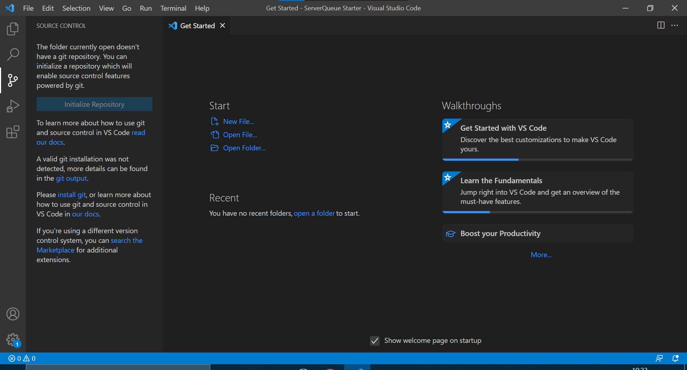
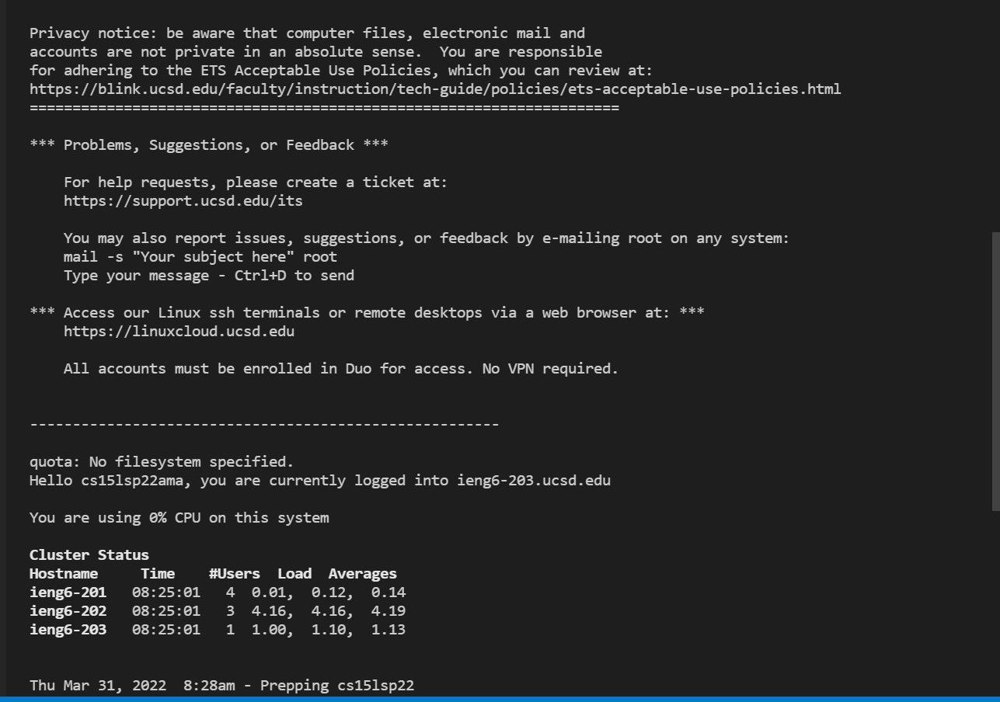
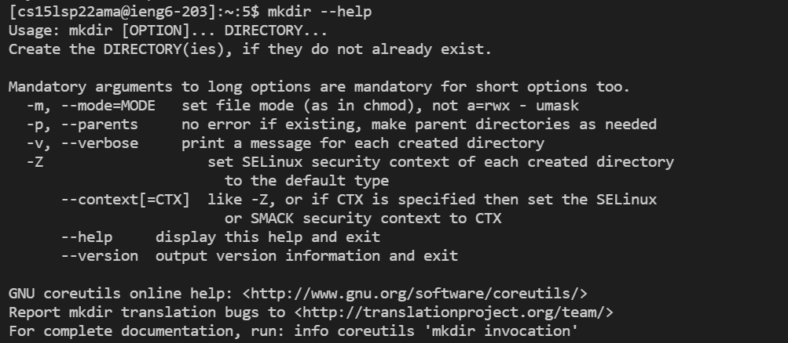
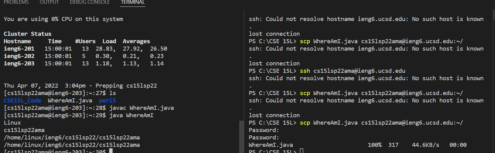
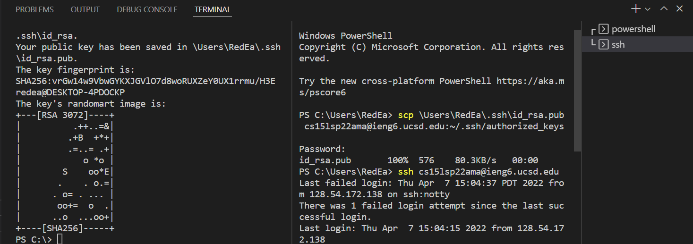
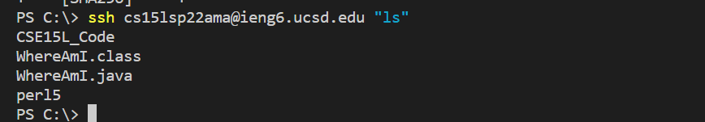

# Lab Report One
 
## 7th April, 2022
 
 
 
Step one of any project is to set up the working environment. For this, a simple install of the Visual Studio Coding environment is more than sufficient to get started, as seen below.
 
Visual Studio Installation:

 
 
Remotely accessing a server, as done below, will allow one to use files not directly on the device they are using, allowing for easier access to a common file without having to install it and save it on all devices you wish to use. This makes it more efficient to access and edit a given file across multiple devices. This can be done using a secure shell, or SSH, command on the host device to the server one wishes to access, results of such a connection can be seen below.
 
Remote Access:

 
 
Anytime one gets something new, the first instinct is always to test its limits, see what it can do using what knowledge they already have over the operations of that object. Coding is no different, below is an image of an early test I ran while experimenting with a secure shell connection. The tests below are attempting to edit a file directory.
 
Command Testing:

 
 
A good early test for connection is to copy a file over to the server, as to make sure the connection is set up properly. This can be done using the scp command, as seen below. This command copies the file from the first location given over to the second location, provided the user knows the method needed to access the directory they are copying to.
 
File Moving:

 
A major convenience for remotely accessing a server is setting it up so that the server recognizes your access point without needing to input your password every time, while still maintaining the security of having a password. This is the exact function that an SSH Key grants. It leaves one file on the client and, using the scp covered above, a file on the server that holds an access key. When you connect to the server from then on, the two files recognize each other and bypass the need for a password to be input.
 
SSHKey setup:

 
 
Commands can be run directly on the client without fully accessing the server. This can be done using this optimization method shown below, essentially the client briefly connects to the server, long enough to run the command given and then disconnects again, which can be useful when you need to run a quick command for a refresher, since it is more effective to use the optimized version.
 
Optimized Running Example:

