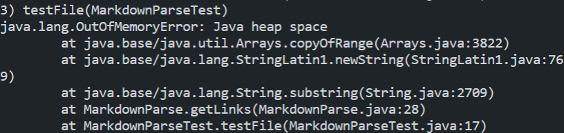

# Lab Report 2
 
21st of April 2022
 
Contained here are a list of three bugs, the causes and the fixes to make a file parsing section of code work as intended.
 
## Bug One
 

 
The first bug explored here is a file without a link included at all. Before this change a file without a valid link would result in an infinite loop, only ending when manually killed or the program runs out of storage to use. The applied fix passes the loop in the event that the file lacks a link in it. Passing the below file through would result in an infinite loop.
 
[Bug One](https://github.com/tcarman/markdown-parser/blob/main/noLink.md)
 
 
## Bug Two
 

 
This screenshot covers two different bugs.
 
The first bug is a set of brackets,[], in one part of the document and a set of parentheses,(), in another part of the document. Since this is not a valid link, this should not be included in a list of links. The solution for this is to add a clause, seen in the first if statement, designed to check to see if the brackets and parentheses are next to each other, thus making it a valid link.
 
The second bug fixed in this image is treating an image as a link. Since with markdown, images and links have similar, but not identical, syntax, the code can be easily confused to return the image as a link. The fix that was implemented is to see if there is an exclamation point, the character used to differentiate between an image and a link, in the file and, if it exists, if the exclamation point is in front of the brackets, which would be where it is placed if it is an image instead of a link. In this case, it would not be considered a link and thus not added to the return.
 
Passing the below files would test both of these cases.
 
[Bug Two](https://github.com/tcarman/markdown-parser/blob/main/test-failure.md)
 
## Bug Three
 

 
The final bug being covered here is the empty line bug. With the original code, an empty line would result in an infinite loop. This line makes sure all of the characters needed for a valid link, brackets [] and parentheses (), are in the remainder of the document after the link has been added to the return list. Before adding this chunk, the code would spin, trying to find characters that did not exist, until it ran out of space and then return nothing, this shortcuts that spinning by breaking the loop. Below is a file that would have caused a bug before this change is implemented.
 
[Bug Three](https://github.com/tcarman/markdown-parser/blob/main/test-file.md)
 
