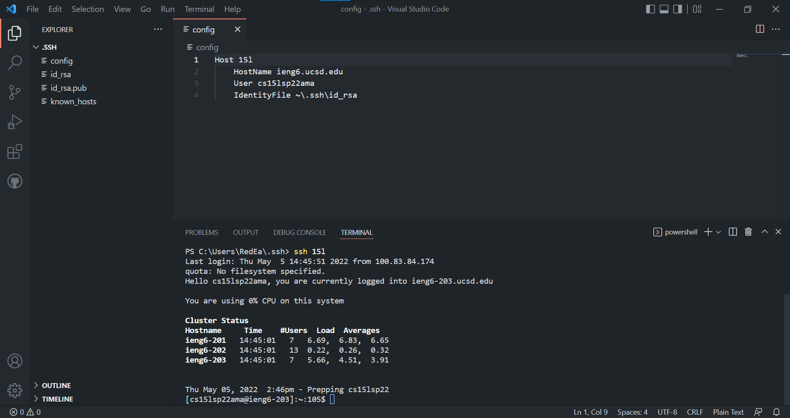
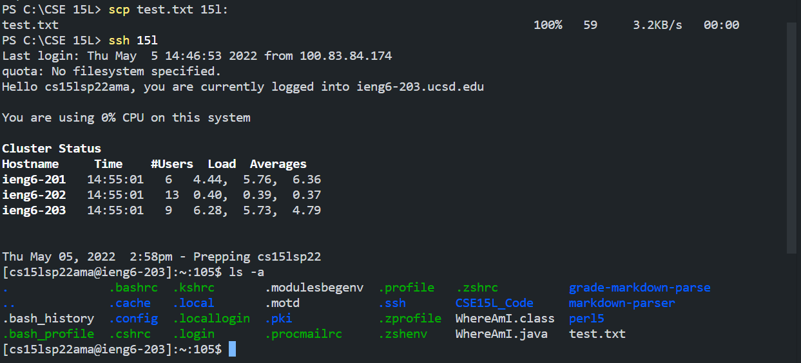
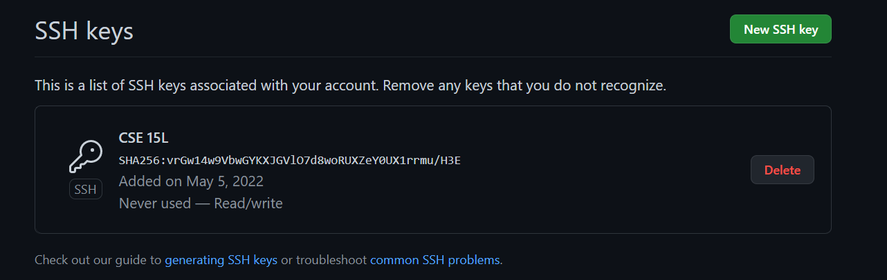
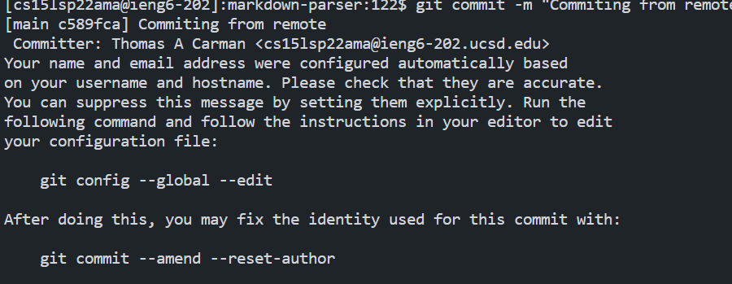
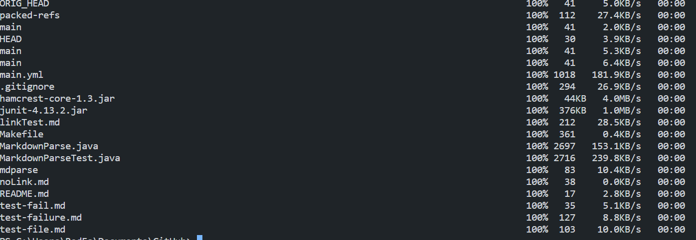
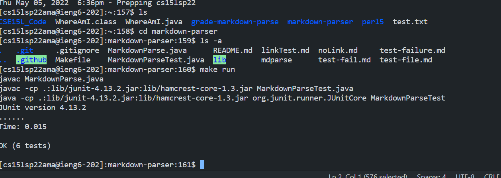
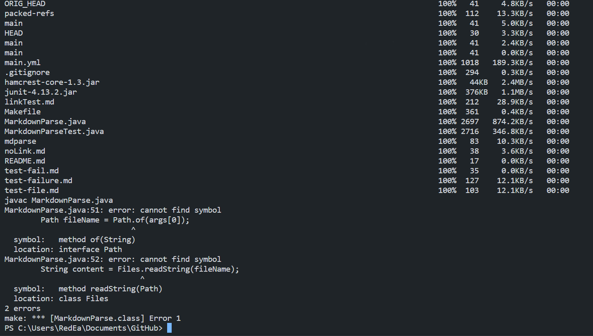

# Lab Report 3

May 5th, 2022

## Stream Lining SSH Connection

Typing out the entire username and remembering the access point for an ssh can be quite time consuming and difficult. A simple way to bipass this need is to rely on the config file and create an alias that is easier to remember. In the above screenshot, the layout of the config file plus a sign in with it can be seen while the below image contains a call to copy a file through the use of the alias, all together a quicker method that is easier to remember.

## GitHub Access from a remote server

With this small addition to a GitHub account, you can push and commit coding updates from a remote server without having to run it back through the device you are using.

Once you have this set up you can commit and push from a remote terminal.Linked [here](https://github.com/tcarman/markdown-parser) is the resulting commit.

## Copying Whole directories 

Using scp - r one can copy an entire directory in one command, which overall takes less time than copying each file on its own.

