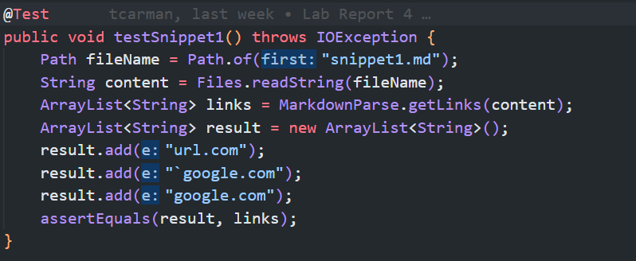
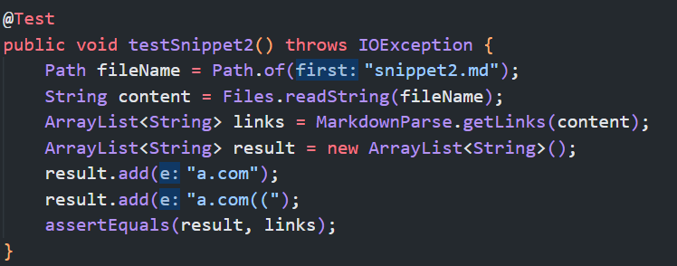
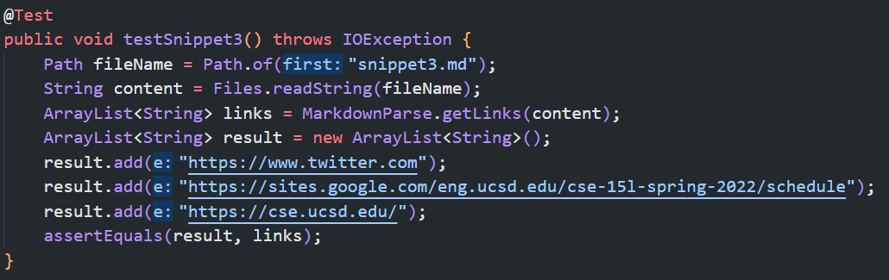
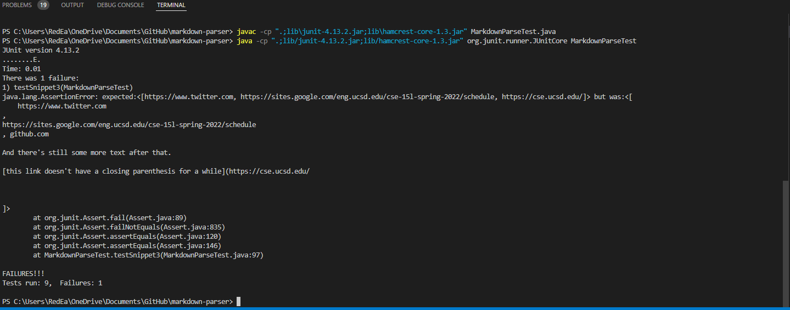
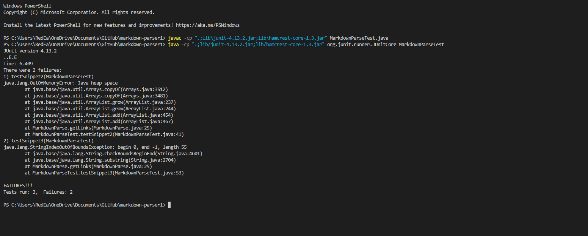

# Lab Report 4

May 22nd, 2022

## Expected Results from Snippets
Snippet1:

Snippet2:

Snippet 3:

## Snippets Running on my code
[Link to the code referenced in this section](https://github.com/tcarman/markdown-parser)

Here is the initial result from running the snippets given on the code I wrote. The issues caused are from the 3rd snippet exclusivly . The first two snippets do not require any change from the code to pass with those, as it already accounted for special characters in the links and nested parenthesis. To fix the issues coming from the second one, a snippet of code that trims links down to just letters and not the spacing after the link, though this would prbabaly take more than 10 lines of code as it would also require a check to see if there is a open bracket before the next end parenthesis which would require some additional points of logic to exculde that given link from the list.

## Snippets Running on Recieved Code
[Link to the code referenced in this section](https://github.com/yuxinguo13/markdown-parser.git)

Here is the intial result from the code I received. The issues here come form the second and third snippet, with one throwing an out of memory error, most commonly an infinate loop, and the other throwing an index out of bounds exception.

The first issue can not be fixed in under 10 lines as it would require a full rewrite of the function. This is being caused by the blank line in the middle. The loop breaks due to the exitance of a next line but the line being blank. This can be fixed by switching it off a line by line reader into a substring parser though that would require editing more than ten lines.

The second issue can not be fixed in under 10 lines as the code is writen to use a line reader and the links go across multiple lines, thus the code requires a full rewrite to be functional for the instances there.
