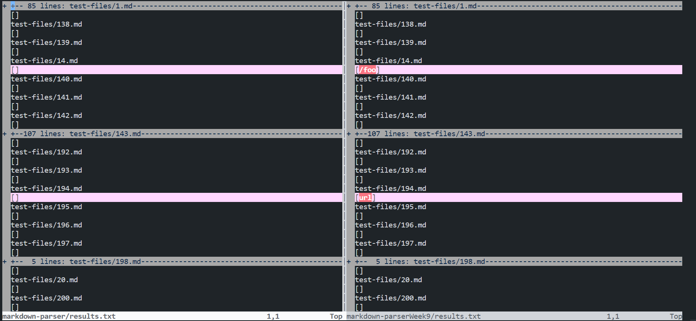
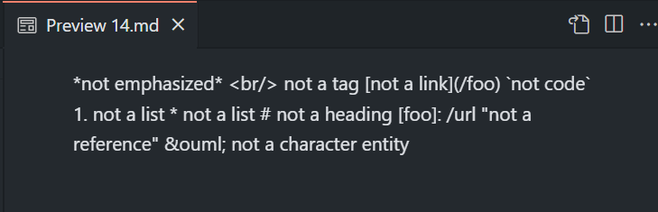

# Lab Report 5

5th of June, 2022

## Finding Differences

The above image was used to find differences between the code that I wrote and the code provided. This was done using the vimdif bash script. The left side is from the code I wrote while the right side is the provided code. As can be seen, there are a few differences shown there that I will get into for a pair of these differences.

## Difference One: Test Case 14

[Link to the First Test File](https://github.com/nidhidhamnani/markdown-parser/blob/main/test-files/14.md)

Above are the links to the markdown test case 14 and a screenshot of it in markdown preview. The result has no links in it, which is what he code on the left returned where as the code on the right had the result of \foo as a link. Thus for this specific implimentation, my code worked better than the provided code. This issue can be fixed by checking for opening characters, such as the \\, that markdown does not display, thus force breaking the link.

## Difference Two: 
[Link to the Second Test File](https://github.com/nidhidhamnani/markdown-parser/blob/main/test-files/194.md)

Above are the link to the markdown test case 194 and a screenshot of that file in markdown preview. Th result has a link in it of url, this is the same as the code on the right. The left code could be fixed by removing the addtion of requiring a domain to be considered a link.